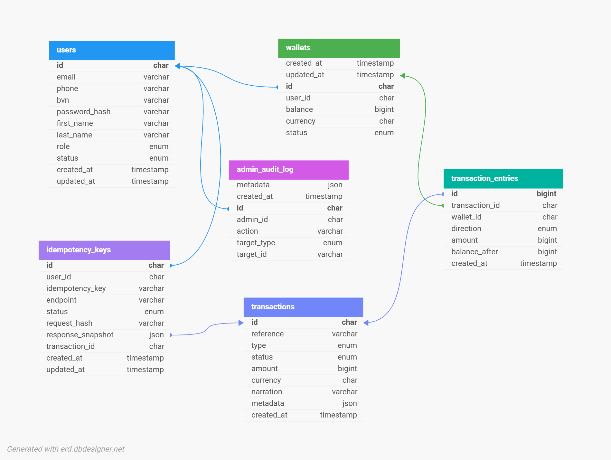
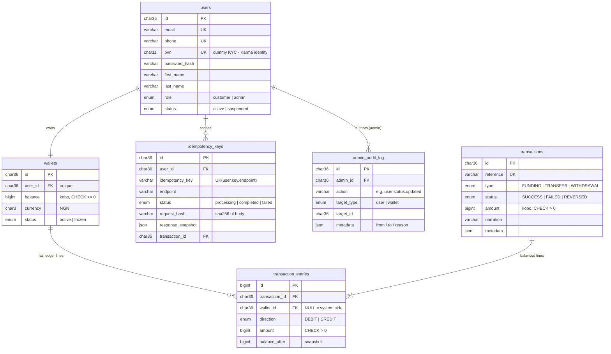

# Demo Credit — Wallet Service

An MVP wallet service for a mobile lending platform. Borrowers receive loans into a wallet, repay from it, and can fund, transfer, and withdraw. Built for the Lendsqr backend engineering assessment.

**Live API:** https://torzor-peter-lendsqr-be-test.onrender.com · **Interactive docs:** https://torzor-peter-lendsqr-be-test.onrender.com/docs · **Security & Failure-Handling Report:** [REPORT.md](REPORT.md)

## Features

- **Account creation** gated by the Lendsqr Adjutor **Karma blacklist** — blacklisted users are never onboarded, and the check **fails closed** if Adjutor is unreachable
- **Fund**, **transfer**, and **withdraw** with correctness guarantees suitable for money movement
- Faux (but signed and expiring) **JWT authentication**
- **Idempotent** money endpoints — network retries can never move money twice
- Append-only **double-entry ledger** with a provable balance invariant
- **Admin module** with role-based access control — suspend users, freeze wallets, run ledger reconciliation, all recorded in an append-only **audit trail**

## Tech Stack

| | |
|---|---|
| Runtime | Node.js 24 LTS, TypeScript (strict) |
| Framework | Express 4 |
| Database | MySQL 8 (InnoDB) via KnexJS |
| Validation | zod (one schema = runtime validation + static types) |
| Auth | jsonwebtoken + bcrypt |
| Logging | pino (structured JSON, request-scoped ids) |
| Testing | Jest + Supertest — 184 tests (unit + integration against real MySQL) |
| Docs | OpenAPI 3 served at `/docs` |

## Architecture

A **modular monolith** with strict one-directional layering:

```
HTTP → Routes → Middleware (auth · zod validation · idempotency · rate limit)
     → Controllers   (HTTP concerns only)
     → Services      (business rules, transaction orchestration)
     → Repositories  (Knex queries — the only layer that touches the DB)
     → MySQL
```

Each domain module (`users`, `auth`, `karma`, `wallets`, `transactions`, `idempotency`, `admin`) owns its routes, controller, service, repository, and validators. Modules interact through service interfaces only. Services receive their dependencies via constructor injection, which is what allows 160+ unit tests to run without a database.

Admin endpoints sit behind two middlewares — `authenticate` then `requireAdmin` — and every privileged state change (suspending a user, freezing a wallet) is written to an append-only `admin_audit_log` **in the same transaction** as the change itself.

At this scale (an MVP that must correctly serve ~1,000 users), a monolith with ACID transactions in one MySQL database is strictly better than distributing the wallet/ledger boundary: a single `BEGIN…COMMIT` solves atomically what microservices would need sagas to approximate.

## E-R Diagram





> The diagram image lives at `src/docs/erd.png`; the Mermaid source above is inline for GitHub rendering.

## Database Design Decisions

**Money is BIGINT kobo.** Integer minor units eliminate floating-point errors entirely.

**Cached balance + double-entry ledger.** `wallets.balance` gives O(1) reads and is backstopped by a `CHECK (balance >= 0)` constraint. Every money movement also writes an immutable transaction header plus **balanced DEBIT/CREDIT ledger lines** — funding and withdrawal post their counter-entry against a system side (`wallet_id NULL`), so every transaction's entries sum to zero. The ledger is the source of truth; the balance column is a derived cache whose correctness is provable:

```
SUM(credits) − SUM(debits) == wallets.balance   — for every wallet, always
```

`npm run reconcile` verifies this invariant (per-wallet drift + global zero-sum) and exits nonzero on any violation. The integration suite runs the same check after a concurrent burst of mixed operations.

**Corrections are reversal transactions, never UPDATEs.** `transactions` and `transaction_entries` are INSERT-only — an audit requirement, not a style preference.

## Correctness Under Concurrency

- **Pessimistic row locks.** Every money operation locks the wallet row(s) with `SELECT … FOR UPDATE`; the balance check happens **under the lock**, making the classic read-then-spend double-spend structurally impossible.
- **Deadlock prevention, not handling.** Transfers lock both wallets in a single query ordered by ascending wallet id — crossing transfers (A→B racing B→A) can never deadlock.
- **One transaction per operation.** Ledger header, entries, balance updates, and idempotency completion commit atomically. Every repository write takes an explicit `trx` parameter, so transaction scope is visible at each call site.
- **Idempotency keys.** Money endpoints require an `Idempotency-Key` header, scoped `(user, key, endpoint)` with a request-body hash. Completed keys replay the stored response; the completion row commits **inside** the money transaction, so a crash can never leave a replayable success that didn't move money.

All four claims are proven by integration tests against real MySQL (`tests/integration/concurrency.test.ts`): concurrent double-spend → exactly one success; crossing transfers → no deadlock; concurrent identical requests → exactly one ledger write; mixed parallel burst → clean reconciliation.

## API Reference

Base path: `/api/v1` · Full interactive spec at `/docs`

| Method | Path | Auth | Idempotency-Key | Description |
|---|---|---|---|---|
| POST | `/users` | — | — | Create account (Karma-screened) |
| POST | `/auth/login` | — | — | Exchange credentials for a JWT |
| GET | `/wallets/me` | ✅ | — | Own wallet balance and status |
| POST | `/wallets/fund` | ✅ | required | Fund own wallet (simulated settlement) |
| POST | `/wallets/withdraw` | ✅ | required | Withdraw to a bank account (simulated) |
| POST | `/transactions/transfer` | ✅ | required | Transfer to another user's wallet |
| GET | `/transactions` | ✅ | — | Own history (keyset paginated) |
| GET | `/transactions/:reference` | ✅ | — | Transaction detail (own wallet only) |
| GET | `/admin/users` | 🔒 admin | — | List/search users with wallet detail |
| GET | `/admin/users/:id` | 🔒 admin | — | One user with wallet detail |
| PATCH | `/admin/users/:id/status` | 🔒 admin | — | Suspend / reactivate a user (audited) |
| PATCH | `/admin/wallets/:id/status` | 🔒 admin | — | Freeze / unfreeze a wallet (audited) |
| GET | `/admin/reconciliation` | 🔒 admin | — | Ledger-vs-balance integrity report |
| GET | `/admin/audit-log` | 🔒 admin | — | Admin action history (paginated) |
| GET | `/health`, `/health/ready` | — | — | Liveness / DB readiness |

🔒 admin routes require a valid token **and** the `admin` role (a customer token gets `403 FORBIDDEN`). Admins are created out-of-band with `npm run create-admin` — the public sign-up only ever mints `customer` accounts.

All amounts are integers in **kobo**. Responses use a uniform envelope: `{ "status": "success", "data": … }` or `{ "status": "error", "code": …, "message": …, "request_id": … }`.

**Client contract for `Idempotency-Key`:** end users never type it — the app generates one key per user *intention* (`crypto.randomUUID()` when the user taps "Send"), and reuses that same key on every automatic retry of that action. A dropped connection or double-tap therefore cannot move money twice: the server replays the original result (`X-Idempotent-Replay: true`). This is the same contract as Stripe's `Idempotency-Key` / PayPal's `PayPal-Request-Id`. In production the `idempotency_keys` table would get a 24–72 h retention sweep and replay-rate metrics.

## Getting Started

**Prerequisites:** Node.js 24, Docker (for local MySQL), an [Adjutor](https://app.adjutor.io) API key.

```bash
git clone <repo-url> && cd demo-credit
npm install
cp .env.example .env          # fill in JWT_SECRET and ADJUTOR_API_KEY
npm run db:up                 # start MySQL 8 in Docker
npm run migrate:latest        # create the schema
npm run dev                   # http://localhost:3000 — docs at /docs
```

### Scripts

| Command | Purpose |
|---|---|
| `npm test` | Full suite — 184 tests (167 unit + 17 integration; integration needs `db:up`) |
| `npm run reconcile` | Verify ledger == balances; exits 1 on drift |
| `npm run create-admin -- <email> <phone> <bvn> <password>` | Create an admin account |
| `npm run typecheck` / `lint` / `format` | Static checks |
| `npm run migrate:latest` / `migrate:rollback` | Schema migrations |
| `npm run build` && `npm start` | Production build and run |

### Testing approach

Unit tests (mocked repositories, no DB) cover every service's success **and** failure paths — blacklist hits, insufficient funds, self-transfers, expired/tampered/forged tokens, idempotency conflicts, retry exhaustion. Integration tests run the full HTTP middleware chain against a real, isolated MySQL database (`demo_credit_test`, provisioned automatically by the test runner) to prove the locking and idempotency behaviour that mocks cannot.

## Deployment

The app is a standard Node service: `npm run build`, run migrations (`npx knex migrate:latest --knexfile knexfile.ts`), then `npm start`. A `Procfile` covers Heroku-style platforms (Railway, Render use their own config). Set `DB_SSL=true` for managed MySQL providers that require TLS; if the provider signs with a private CA (e.g. Aiven), also set `DB_SSL_CA` to the base64-encoded CA certificate. `DB_CONNECT_TIMEOUT_MS` widens the connection budget for remote databases. The process refuses to boot if any required environment variable is missing.

## What I Would Improve for Production

- **Real settlement:** payment-gateway webhooks for funding, async payout pipeline for withdrawals (`PENDING` → queue → webhook settlement) using the transactional outbox pattern — the `status` enum and reversal mechanism already accommodate this
- **Scale-out:** the API is stateless (locks and idempotency live in MySQL), so multi-instance deployment needs only Redis-backed rate-limit counters; read replicas for statement queries; partitioning of `transaction_entries` as history grows
- **Security:** refresh-token rotation, MFA on withdrawals, real BVN/KYC verification with tiered limits, secrets manager, fraud/velocity rules
- **Operations:** promote `npm run reconcile` to a scheduled job with drift alerting, OpenTelemetry tracing, Sentry, CI/CD with migration gating
